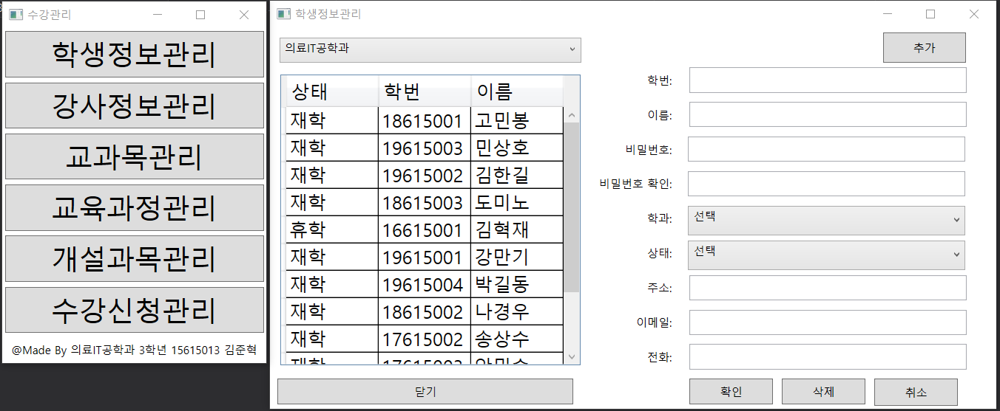

# Enrollment_Management_Program
> 학부생 3학년 1학기 때 개발한 수강관리프로그램

## 개발기간 
* 2019.05.17.~2019.06.05. (약15일)

##	주요기능
* 데이터베이스에서 자료를 가져와 학생정보를 관리함
* 입력데이터에 대해 유효성검사 적용

## Development setup
* Framework: .Net 4.7.2
* DBMS: Access 2010

## Release History

* 1.0.0
    * first
    * 개발 완료

## Contact

김준혁 – kimjunhyeok.it@gmail.com
